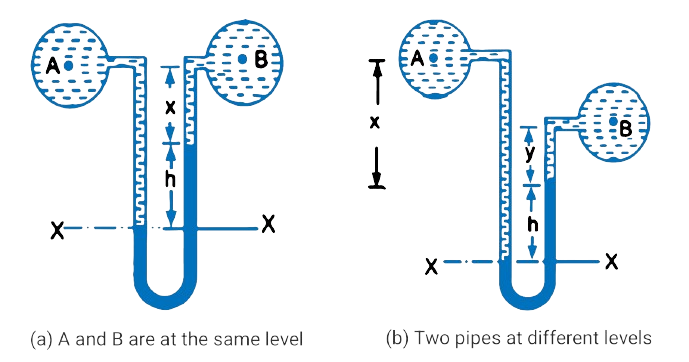

<h2>U-Tube Differential Manometer</h2>

Fig. 1. shows the differential manometer of U-tube type.

 

$$Fig. 1\ \ U\ Tube\ differential\ manometers$$

In Fig. 1 (b), the two points A and B are at different level and also contains liquids of different sp. gr. These points are connected to the U-tube differential manometer. Let the pressure at A and B are PA and PB

Let

&emsp;&emsp; h = Difference of mercury level in the U-tube.  
&emsp;&emsp; y = Distance of the centre of B, from the mercury level in the right limb.  
&emsp;&emsp; x = Distance of the centre of A, from the mercury level in the right limb.  
&emsp;&emsp; &rho;1 = Density of liquid at A.  
&emsp;&emsp; &rho;2 = Density of liquid at B.  
&emsp;&emsp; &rho;g = Density of heavy liquid or mercury.  

 

Taking datum line at X-X.

Pressure above X-X in the left limb = &rho;1g(h + x) + PA  
where PA = pressure at A.

Pressure above X-X in the right limb = &rho;g &times; g &times; h + &rho;2 &times; g &times; y + PB   
where PB = Pressure at B.

Equating the two pressure, we have

$$
\rho_1g(h + x) + P_A = \rho_g × g × h + \rho_2gy + P_B
$$

$$ ∴ \qquad \qquad P_A -P_B = \rho_g × g × h + \rho_2gy - \rho_1g(h+x) $$
$$ = h × g(\rho_g - \rho_1) + \rho_2gy - \rho_1gx \qquad \qquad \qquad ...equ(1) $$

$$ ∴\ \ Difference\ of\ pressure\ at\ A\ and\ B = h × g(\rho_g -\rho_1 ) + \rho_2gy - \rho_1gx $$

In Fig. 1(a), the two points A and B are at the same level and contains the same liquid of density &rho;1. Then

$$ Pressure\ above\ X-X\ in\ right\ \ limb = \rho_g × g × h + \rho_1 × g × x +P_B $$
$$ Pressure\ above\ X-X\ in\ left\ \ limb = \rho_1 × g × (h+x) + P_A $$

Equating the two pressure

$$ \rho_g × g × h + \rho_1gx +P_B = \rho_1 × g × (h+x) + P_A $$

$$ ∴ \qquad \qquad P_A - P_B = \rho_g × g × h + \rho_1gx - \rho_1g(h+x) $$
$$ = g × h(\rho_g - \rho_1) \qquad \qquad \qquad ...equ(2) $$